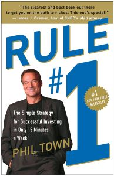

# *Rule #1*

*Rule #1* by Phil Town centers on two main ideas:

1. Rule #1. "Don't lose money"
2. The Four M's:
    1. Meaning
    2. Moat
    3. Management
    4. Margin of Safety

Learn these ideas and the depth of the Four M's.

In essence, don't think of buying stocks, but think instead of "buying a wonderful business at an attractive price" (43).

From page 44:
> Rule #1 investing comes down to four straightforward steps: 
> 1. Find a wonderful business (i.e. it has *meaning* to you)
> 2. Know what it's worth as a business
> 3. Buy it at **50% off**
> 4. Repeat until very rich

## Don't Lose Money
This is obvious, *prima facie,* but means more than just the tongue-in-cheek of it.

"The price of a thing is not equal to its value" (45).

## Meaning
"*Does the business have Meaning to you?* -- implies two other questions: (1) Do you want to own the whole business? and (2) Do you understand it well enough to own all of it?" (49).

### The 10-10 Rule
> The 10-10 Rule: I won't own this business for ten minutes unless I'm willing to own it for ten years.

Consider what your passions, money, and talents. What areas overlap all three times? That's the kind of company to own.

You must research companies/stocks that match your passion/money/talent overlap and collect a list of companies accordingly using the [Global Industry Classification Standard (GICS)](https://www.investopedia.com/terms/g/gics.asp).

## Moat
A moat means the company is protected somehow from outside attack (from competitor business). It speaks to the company's future certainty. "A business with a wide Moat is much mor epredictable for the next 20 years than a business with no Moat" (67).

> A Rule #1 company will always be one that can ride any inflation wave. That's the purpose of the Moat around the castle: protection from inflation and competition.

### The Five Moats

| Type | Definition | Example
|------|------------|---------
|Brand | a product you're willing to pay more for b/c you trust it | Coke, Disney, Nike
|Secret| a biz that has a patent/trade secret that makes competition illegal/very tough | Pfizer, 3M, Intel
| Toll | a biz with exclusive control of a market ("toll" collectors) | media companies, utilities, ad agencies
| Switching | a biz that makes switching to others too much trouble | Microsoft, Apple, H&R Block (?)
| Price | a biz that can price products so low no one can compete | Wal-Mart, Costco, Bed Bath & Beyond

### The Big Five
1. Return on Investment Capital (ROIC)
2. Sales*
3. Earnings per Share (EPS)*
4. Equity, or Book Value per Share (BVPS),*
5. Free Cash Flow (FCF or Cash)*

\* growth rates

> All Big Five numbers should be equal to/greater than 10%/year for the last 10 years

#### ROIC
The rate of return a business makes on the **cash it invests in itself each year.**

> ROIC = profit ÷ invested capital

If this is not above 10% / year on average for the last ten years, **move on**

#### The Four Growth Rates
1. Sales - total $ taken in from selling product/service
2. EPS - how much the biz profits / share of ownership *
3. Equity - $ left over if everything's sold off & debts are paid 
    BVPS is what everyone gets when equity is divied up per share
4. Free cash flow - "cash grwoth" tells whether cash is growing w/ profits or just on paper

\* Often called "the bottom line"

> Consistent numbers are what we're looking for (87)

